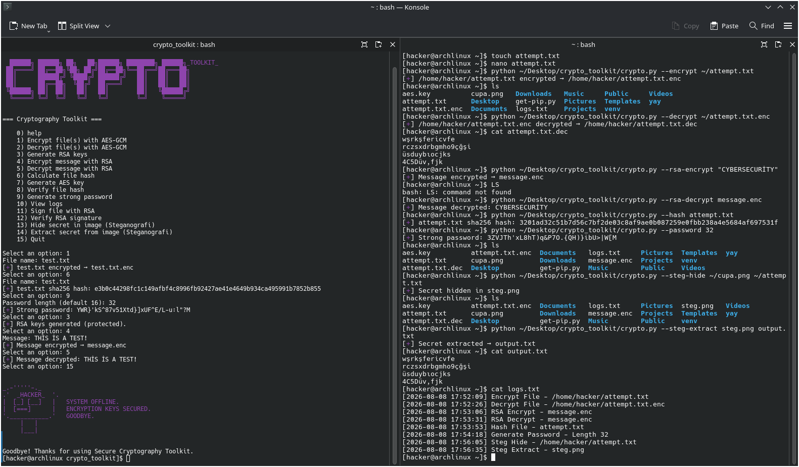

                             ██████╗ ██████╗ ██╗   ██╗██████╗ ████████╗ ██████╗_TOOLKIT_
                             ██╔════╝ ██╔══██╗╚██╗ ██╔╝██╔══██╗╚══██╔══╝██╔═══██╗
                             ██║      ██████╔╝ ╚████╔╝ ██████╔╝   ██║   ██║   ██║
                             ██║      ██╔══██╗  ╚██╔╝  ██╔═══╝    ██║   ██║   ██║
                             ╚██████╗ ██║  ██║   ██║   ██║        ██║   ╚██████╔╝
                              ╚═════╝ ╚═╝  ╚═╝   ╚═╝   ╚═╝        ╚═╝    ╚═════╝
                                          Secure Cryptography Toolkit


## Purpose
Data security is a critical necessity in today's digital environment. By consolidating fundamental cryptographic operations into a menu-driven or single command-line interface, this toolkit offers a range of capabilities, including secure file processing, message protection, integrity verification, and the storage of sensitive data.  

Professional objectives of the toolkit:  
- **Applied Security**: Implements industry-standard algorithms such as AES-GCM and RSA for file and message protection.  
- **Integrity Assurance**: Provides SHA256 hashing and signature verification to ensure data has not been altered.  
- **Authentication**: Uses RSA signing and verification to confirm the authenticity of files and sources.  
- **Confidentiality**: Offers steganography to conceal information within PNG images for an additional security layer.  
- **Educational Use**: Serves as a practical tool for students and researchers to experiment with cryptographic concepts.  

This toolkit is designed for both **cybersecurity professionals** and **academic/research environments**.

---




## Features
- AES-GCM file encryption/decryption  
- RSA key generation, message encryption/decryption  
- RSA file signing and signature verification  
- SHA256 hashing and integrity checks  
- Strong password generation  
- Steganography for hiding/extracting data in PNG images  
- ASCII menu interface with quick reply
- Command-line argument support → Run specific operations directly with flags (e.g., --encrypt, --manual, --password) without using the interactive menu.

---

## 📦 Installation
```bash
git clone https://github.com/aybiketutarr/crypto_toolkit.git
cd crypto_toolkit
python crypto.py


